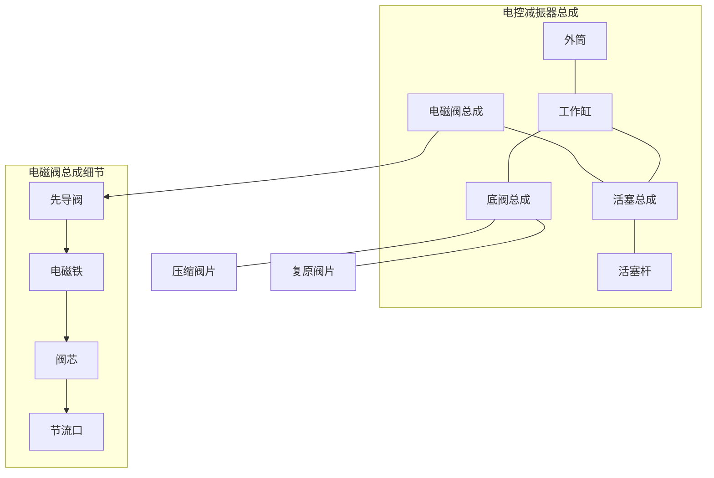
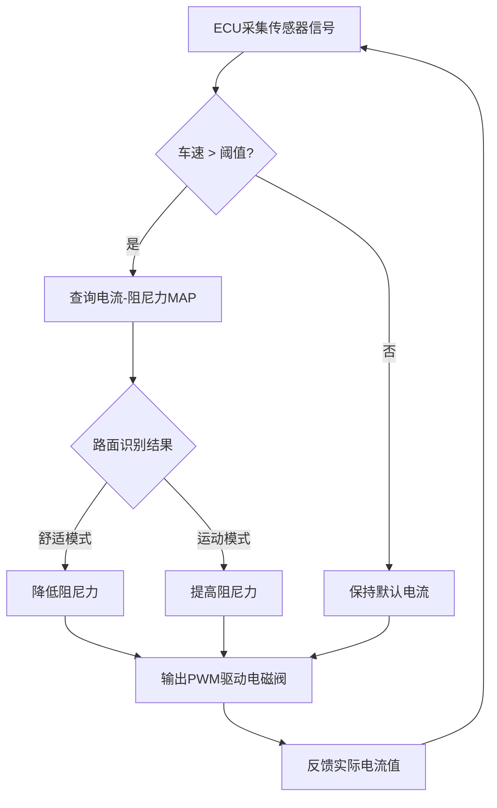
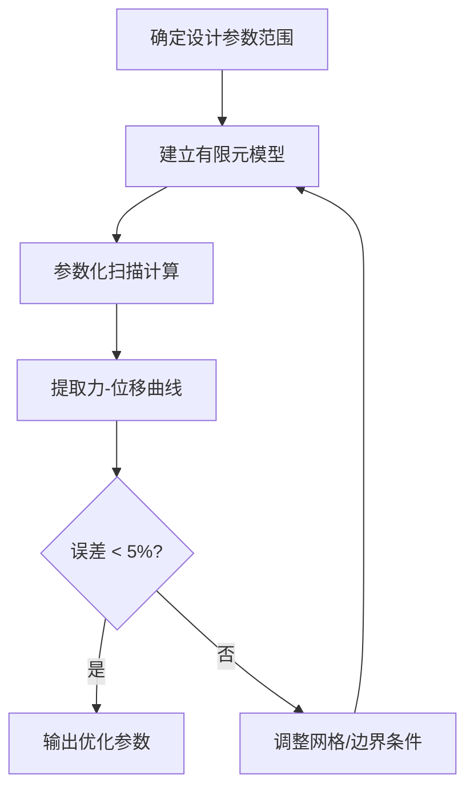
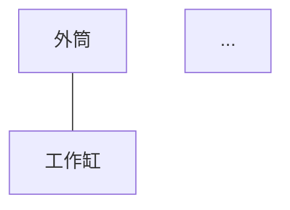
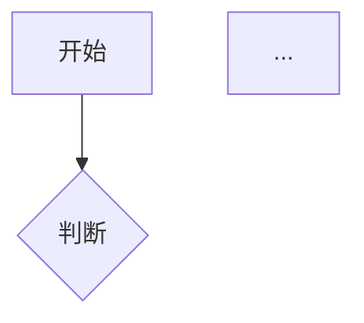

# 模板参考：Mermaid 图示范例

交底书 §3.2（系统框图）和 §3.4（流程图）使用 Mermaid 绘制，不使用 ASCII 框图 / PlantUML。

## 系统框图（减振器）



## 系统框图（工艺）


## 流程图（控制逻辑）



## 流程图（方法步骤）



## Mermaid 块标记

在 .md 正文中的写法：

````markdown
### 3.2 系统框图



### 3.4 流程图


````

**不**使用 PlantUML，**不**使用 ASCII 文字框图。

## 定稿渲染

```bash
python3 tools/mermaid_render.py --input disclosure.md
```

渲染依赖 `mmdc`（`npm install @mermaid-js/mermaid-cli` 或使用 `npx mmdc`）。内存不足时尝试加 `--puppeteerConfigFile .puppeteer.json`。